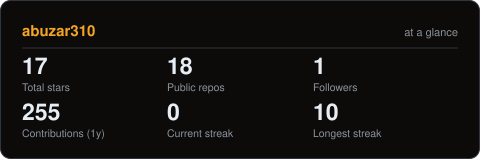
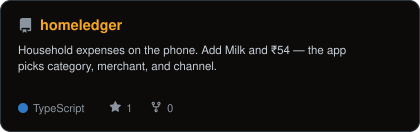
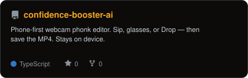
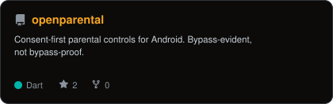
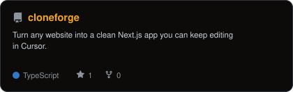

<picture>
  <source media="(prefers-color-scheme: dark)"  srcset="assets/banner-dark.svg?v=2">
  <source media="(prefers-color-scheme: light)" srcset="assets/banner-light.svg?v=2">
  
</picture>

 

 

&nbsp;&nbsp;
&nbsp;&nbsp;
&nbsp;&nbsp;

 

---

## This is me :)

Hi, I'm **Mohammed Abuzar**, full-stack developer and systems engineer, shipping from India.

I build production web apps, business tooling, and open-source products end to end — from the family timber shop to consent-first Android tools.

- 🏭 **Founder & Full Stack at [Abuzar Industries](https://abuzar-industries.vercel.app)**: quotations, invoices, and the public site that replaced paper paperwork.
- 🏠 **[HomeLedger](https://homeledger-olive.vercel.app)**: household expenses on the phone. Add Milk and ₹54 — the app organises the rest.
- 🛡️ **[OpenParental](https://github.com/abuzar310/openparental)**: consent-first parental controls for Android. Bypass-evident, not bypass-proof.
- 🔐 **[Vibe-Sec](https://github.com/abuzar310/vibe-sec)**: a Claude Code skill that checks AI-written code for the holes assistants keep introducing.
- 🌱 **My mission:** ship things people actually use. Client sites, shop books, review funnels, tools.
- 💬 Talk to me about **Next.js, Flutter, and building for a real business** — you'll have my full attention.

 

## my perfect stack`

---

## signals

<table>
<tr>
<td width="50%" align="center" valign="middle">

<picture>
  <source media="(prefers-color-scheme: dark)"  srcset="assets/radar-dark.svg">
  <source media="(prefers-color-scheme: light)" srcset="assets/radar-light.svg">
  
</picture>

</td>
<td width="50%" align="center" valign="middle">

<picture>
  <source media="(prefers-color-scheme: dark)"  srcset="assets/radar-langs-dark.svg">
  <source media="(prefers-color-scheme: light)" srcset="assets/radar-langs-light.svg">
  
</picture>

</td>
</tr>
</table>

---

## Numbers matter? ohhh yes.

<picture>
  <source media="(prefers-color-scheme: dark)"  srcset="assets/card-stats-dark.svg">
  <source media="(prefers-color-scheme: light)" srcset="assets/card-stats-light.svg">
  
</picture>

---

## shipping

<table>
<tr>
<td width="50%" align="center">
<a href="https://github.com/abuzar310/homeledger">
<picture>
  <source media="(prefers-color-scheme: dark)" srcset="assets/card-homeledger-dark.svg">
  <source media="(prefers-color-scheme: light)" srcset="assets/card-homeledger-light.svg">
  
</picture>
</a>
</td>
<td width="50%" align="center">
<a href="https://github.com/abuzar310/confidence-booster-ai">
<picture>
  <source media="(prefers-color-scheme: dark)" srcset="assets/card-confidence-booster-ai-dark.svg">
  <source media="(prefers-color-scheme: light)" srcset="assets/card-confidence-booster-ai-light.svg">
  
</picture>
</a>
</td>
</tr>
<tr>
<td width="50%" align="center">
<a href="https://github.com/abuzar310/openparental">
<picture>
  <source media="(prefers-color-scheme: dark)" srcset="assets/card-openparental-dark.svg">
  <source media="(prefers-color-scheme: light)" srcset="assets/card-openparental-light.svg">
  
</picture>
</a>
</td>
<td width="50%" align="center">
<a href="https://github.com/abuzar310/cloneforge">
<picture>
  <source media="(prefers-color-scheme: dark)" srcset="assets/card-cloneforge-dark.svg">
  <source media="(prefers-color-scheme: light)" srcset="assets/card-cloneforge-light.svg">
  
</picture>
</a>
</td>
</tr>
</table>

---

` Build with copper · @abuzar310 `

